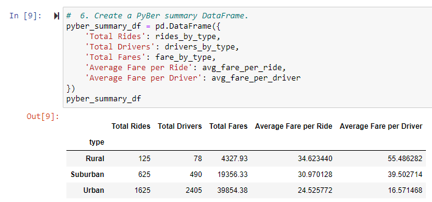
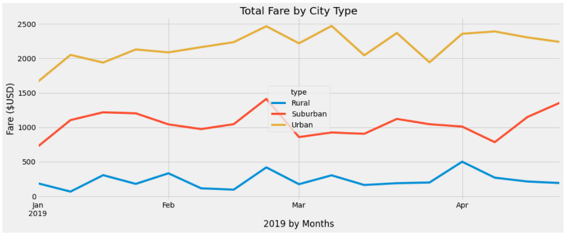

# PyBer_Analysis

## Matplotlib
Bar, Box & Whisker, Bubble, Line, Pie, and Scatter Plots

# Analysis Overview

PyBer a ride sharing platform intended to review the business data points that falls into three categories: Rural, Suburban, Urban.  An initial review was to be supported by additional data breaking out information by the three city types.  Matplotlib was used to create charts and modify existing charts for a cleaner presentation of data.  For example, adding error bars to line charts.  Helpful statistics including mean, median, mode was also compiled using Numpy, Pandas, and SciPy packages.  The code was compiled in a Jupyter Notebook, that used a Python kernel, mainly utilizing Matplotlib.  The objective was to create a summary DataFrame along with a multi-line graph for the total weekly fares broken out for each specific city type.

## Analysis Review

Initial objective, the summary DataFrame, this was created using the groupby() functions.  Merging the data sets of fare per ride and fare per driver and calculating the averages between city types.

Rural: has the least amount of work but the highest per ride / driver fares.
Suburban: sits in the middle of the pack but a distant second to Urban.  The fares are like Rural are higher than Urban for both rider and driver.
Urban: this category almost doubles the total fare amount of Suburban but has the lowest fares for both rider and driver.  A deeper dive of driver per region and monthly total pay would push the data further on driver compensation.

Secondary objective, create a new DataFrame from the summary DataFrame to display the total fares by city type grouped by weeks.

This line chart shows the peak and down time uses of the PyBer services.  The city type with the most fluctuation is Suburban.  We do see fluctuations in the other city types with Rural having the least inflections.  The most used services does fast troughs the end Feb and throughout Mar.

## Analysis Results:

* PyBer's largest revenue stream comes from urban cities.
* Urban cities have the most demand for rides, this correlates the most drivers by city type.
* Urban drivers are paid the least per ride and further analysis is needed to know if they make more in total on average by providing more rides than other city types.
* The high cost of Rural rides could be hindering profits.
* The Suburban portion of the business is a great supplement to the overall business pulling in good revenue with less drivers.
* In summary, each city type has unique challenges.

Managing each city type individually will steer the company’s success best.  Taking the best practices from each city type and having a common foundation is key but understanding each city type requires specific fit for purpose goals is the best route.
